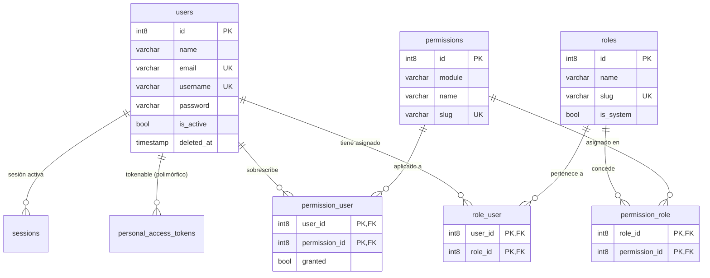

# 09 — Auditoría Exhaustiva de la Base de Datos Actual

> **Fecha de auditoría**: 23 de Septiembre de 2026  
> **Motor de Base de Datos**: PostgreSQL 16+ (Driver `pgsql`, Base de datos: `erp_instituto`)  
> **Framework ORM**: Laravel 13 / Eloquent  
> **Propósito**: Radiografía técnica integral del estado de persistencia antes del diseño y evolución del Módulo de Admisión.

---

## 1. Resumen Ejecutivo del Estado Actual

La base de datos del ERP Instituto opera sobre **PostgreSQL**. Cuenta actualmente con **15 tablas físicas en el esquema `public`**, orientadas primordialmente al **núcleo de identidad, autenticación, control de acceso basado en roles (RBAC) y soporte de infraestructura de Laravel**.

Se verificó el estado real de tablas, filas, constraints y claves foráneas mediante inspección directa en el motor.

---

## 2. Catálogo Técnico de Tablas Existentes

A continuación se detalla cada tabla existente, su función, volumen actual y especificación técnica de columnas:

### 2.1 Tablas de Identidad, Autenticación y Autorización (RBAC)

#### A. `users` (2 registros)
- **Propósito**: Representa las cuentas de acceso al sistema informático (credenciales e identidad digital).
- **Columnas**:
  - `id` (`int8`, PK, Autoincremental)
  - `name` (`varchar(255)`, Not Null): Nombre visible del usuario.
  - `email` (`varchar(255)`, Not Null, Unique): Correo electrónico de acceso/contacto.
  - `username` (`varchar(100)`, Nullable, Unique): Nombre de usuario alternativo.
  - `email_verified_at` (`timestamp`, Nullable): Marca de tiempo de verificación de correo.
  - `password` (`varchar(255)`, Not Null): Hash Bcrypt de la contraseña.
  - `is_active` (`bool`, Default `true`, Index): Estado lógico de la cuenta (activa/inactiva).
  - `last_login_at` (`timestamp`, Nullable): Fecha y hora del último acceso exitoso.
  - `remember_token` (`varchar(100)`, Nullable): Token de sesión recordada.
  - `created_at`, `updated_at` (`timestamp`, Nullable): Timestamps de auditoría.
  - `deleted_at` (`timestamp`, Nullable): Soporte para borrado lógico (`SoftDeletes`).
- **Datos reales en BD**:
  - ID 1: `Super Administrador` (`admin@erp-instituto.edu.pe`, username: `superadmin`, is_active: `true`).
  - ID 2: `Docente Prueba` (`docente123@gmail.com`, username: `docente123`, is_active: `true`).

#### B. `roles` (4 registros)
- **Propósito**: Catálogo de roles institucionales para el esquema RBAC.
- **Columnas**:
  - `id` (`int8`, PK, Autoincremental)
  - `name` (`varchar(100)`, Not Null): Nombre legible del rol.
  - `slug` (`varchar(100)`, Not Null, Unique): Identificador único en código.
  - `description` (`text`, Nullable): Detalle de responsabilidades del rol.
  - `is_system` (`bool`, Default `false`): Flag de protección para roles inmutables.
  - `created_at`, `updated_at` (`timestamp`, Nullable)
- **Datos reales en BD**:
  - ID 1: `superadmin` — "Super Administrador" (`is_system = true`).
  - ID 2: `admin` — "Administrador" (`is_system = false`).
  - ID 3: `docente` — "Docente" (`is_system = false`).
  - ID 4: `estudiante` — "Estudiante" (`is_system = false`).

#### C. `permissions` (12 registros)
- **Propósito**: Catálogo granular de permisos individuales jerárquicos por módulo (`modulo.recurso.accion`).
- **Columnas**:
  - `id` (`int8`, PK, Autoincremental)
  - `module` (`varchar(50)`, Not Null, Index): Módulo funcional al que pertenece.
  - `name` (`varchar(100)`, Not Null): Etiqueta descriptiva.
  - `slug` (`varchar(100)`, Not Null, Unique): Código de verificación de permisos.
  - `description` (`text`, Nullable): Explicación del alcance del permiso.
  - `created_at`, `updated_at` (`timestamp`, Nullable)
- **Datos reales en BD**:
  - Módulo `usuarios` (7): `usuarios.usuarios.ver`, `usuarios.usuarios.crear`, `usuarios.usuarios.editar`, `usuarios.usuarios.deshabilitar`, `usuarios.usuarios.reactivar`, `usuarios.roles.ver`, `usuarios.roles.asignar`.
  - Módulo `estudiantes` (5): `estudiantes.estudiantes.ver`, `estudiantes.estudiantes.crear`, `estudiantes.estudiantes.editar`, `estudiantes.estudiantes.deshabilitar`, `estudiantes.estudiantes.reactivar`.

#### D. `role_user` (2 registros)
- **Propósito**: Tabla intermedia (N:M) que vincula usuarios con roles.
- **Columnas**:
  - `user_id` (`int8`, Not Null, FK -> `users.id` con `ON DELETE CASCADE`)
  - `role_id` (`int8`, Not Null, FK -> `roles.id` con `ON DELETE CASCADE`)
  - `created_at` (`timestamp`, Default `CURRENT_TIMESTAMP`)
- **Restricción**: Clave primaria compuesta `(user_id, role_id)`.

#### E. `permission_role` (12 registros)
- **Propósito**: Tabla intermedia (N:M) que asocia permisos predeterminados a cada rol.
- **Columnas**:
  - `role_id` (`int8`, Not Null, FK -> `roles.id` con `ON DELETE CASCADE`)
  - `permission_id` (`int8`, Not Null, FK -> `permissions.id` con `ON DELETE CASCADE`)
  - `created_at` (`timestamp`, Default `CURRENT_TIMESTAMP`)
- **Restricción**: Clave primaria compuesta `(role_id, permission_id)`.

#### F. `permission_user` (0 registros)
- **Propósito**: Sobrescritura directa de permisos por usuario (concesión o denegación explícita sin alterar su rol).
- **Columnas**:
  - `user_id` (`int8`, Not Null, FK -> `users.id` con `ON DELETE CASCADE`)
  - `permission_id` (`int8`, Not Null, FK -> `permissions.id` con `ON DELETE CASCADE`)
  - `granted` (`bool`, Default `true`): `true` = otorgado directamente, `false` = lista negra (revocado).
  - `created_at` (`timestamp`, Default `CURRENT_TIMESTAMP`)
- **Restricción**: Clave primaria compuesta `(user_id, permission_id)`.

---

### 2.2 Tablas de Sesiones, Tokens y Seguridad

#### A. `personal_access_tokens` (3 registros)
- **Propósito**: Almacenamiento de Bearer tokens de Laravel Sanctum para la API REST.
- **Columnas**: `id` (`int8`, PK), `tokenable_type` (`varchar`), `tokenable_id` (`int8`), `name` (`varchar`), `token` (`varchar(64)`), `abilities` (`text`), `last_used_at` (`timestamp`), `expires_at` (`timestamp`), `created_at`, `updated_at`.
- **Uso**: Autenticación del frontend SPA React con el backend Laravel.

#### B. `password_reset_tokens` (0 registros)
- **Propósito**: Tokens temporales para restablecimiento de contraseñas.
- **Columnas**: `email` (`varchar`, PK), `token` (`varchar`), `created_at` (`timestamp`).

#### C. `sessions` (4 registros)
- **Propósito**: Persistencia de sesiones HTTP estándar de Laravel (`SESSION_DRIVER=database`).
- **Columnas**: `id` (`varchar`, PK), `user_id` (`int8`, Index), `ip_address` (`varchar(45)`), `user_agent` (`text`), `payload` (`text`), `last_activity` (`int4`, Index).

---

### 2.3 Tablas de Infraestructura y Soporte de Laravel

#### A. `migrations` (8 registros)
- **Propósito**: Control de versiones de migraciones ejecutadas.
- **Registros actuales**:
  1. `0001_01_01_000000_create_users_table` (Batch 1)
  2. `0001_01_01_000001_create_cache_table` (Batch 1)
  3. `0001_01_01_000002_create_jobs_table` (Batch 1)
  4. `2026_09_18_000001_create_roles_table` (Batch 1)
  5. `2026_09_18_000002_create_permissions_table` (Batch 1)
  6. `2026_09_18_000003_create_role_permission_pivot_tables` (Batch 1)
  7. `2026_09_18_000004_create_personal_access_tokens_table` (Batch 1)
  8. `2026_09_22_000001_create_students_table` (Batch 2) *(Ver sección de inconsistencias)*

#### B. `cache` y `cache_locks` (0 registros)
- **Propósito**: Almacenamiento de clave-valor para caché del sistema.

#### C. `jobs`, `job_batches`, `failed_jobs` (0 registros)
- **Propósito**: Gestión de colas de procesamiento asíncrono en base de datos (`QUEUE_CONNECTION=database`).

---

## 3. Diagrama de Relaciones Actual (ERD)

---

## 4. Hallazgos de la Auditoría: Inconsistencias, Redundancias y Riesgos

### 4.1 Inconsistencias Detectadas
1. **Registro Huérfano en `migrations` (Batch 2)**:
   - En la tabla `migrations` figura registrada la migración `2026_09_22_000001_create_students_table`.
   - Sin embargo, el archivo físico **no existe en el repositorio** (`backend/database/migrations/`) y la tabla `students` **no existe físicamente en PostgreSQL**.
   - *Causa probable*: Se ejecutó la migración previamente en una prueba local y posteriormente se realizó un `git checkout/clean` sin ejecutar un rollback en la BD.
   - *Impacto*: Si se intenta correr `php artisan migrate`, Laravel considerará que la migración ya fue aplicada y omitirá cualquier creación futura con ese mismo nombre de archivo.
2. **Permisos de `estudiantes` en la BD sin tabla de negocio**:
   - En la tabla `permissions` existen 5 registros para el módulo `estudiantes` (IDs 8 al 12), a pesar de que no existe ninguna tabla de estudiantes creada en el motor.

### 4.2 Posibles Redundancias y Limitaciones Estructurales
1. **Monolito de Nombre en `users.name`**:
   - La tabla `users` almacena el nombre como un único campo de texto `name` (ej. "Super Administrador" o "Docente Prueba").
   - En el contexto de educación superior en Perú (IESP), se exige la discriminación estricta entre **Nombres**, **Apellido Paterno** y **Apellido Materno** para emisión de actas oficiales, nóminas y constancias ante el MINEDU.
2. **Duplicidad de Mecanismo de Sesión**:
   - Coexisten tablas para sesiones web (`sessions`) y tokens de API (`personal_access_tokens`). Esto no es un error (Laravel Sanctum lo soporta), pero la SPA React utiliza exclusivamente `personal_access_tokens`.

### 4.3 Riesgos para el Dominio Institucional
1. **Inexistencia de una Entidad Transversal `personas`**:
   - Actualmente **no existe ninguna tabla que represente a las personas físicas**.
   - Toda la identidad reside en `users`. Esto genera el riesgo inminente de forzar que cualquier postulante, familiar, egresado o aspirante tenga que crearse obligatoriamente como `user` (con correo institucional y password), o peor aún, duplicar sus datos personales en cada módulo nuevo (Admisión, Académico, RRHH, etc.).

---

## 5. Elementos que Deben Conservarse y Protegerse

1. **Tabla `users` y credenciales**: Cero modificaciones destructivas. Los usuarios ID 1 (`superadmin`) e ID 2 (`docente123`) deben mantener su acceso inalterado.
2. **Esquema RBAC (`roles`, `permissions`, `role_user`, `permission_role`, `permission_user`)**: Estructura sólida, probada y compatible con el trait `HasRolesAndPermissions`.
3. **Mecanismo de Tokens Sanctum**: Crucial para el funcionamiento de la SPA React.
4. **SoftDeletes y Auditoría**: Conservar la política de no eliminación física en todas las entidades clave.

---

## 6. Elementos que Pueden Mejorarse

1. **Regularización de `migrations`**: Sincronizar formalmente el historial de migraciones para eliminar el registro huérfano de `students` o regularizarlo de forma limpia.
2. **Incorporación de la Entidad `personas`**: Crear una base sólida y desacoplada de los usuarios para gestionar los datos civiles de postulantes, estudiantes, docentes y administrativos.
---

## 7. Evolución Ejecutada: Módulo de Admisión, Tesorería y Emisión de FUT

Conforme a la metodología SDD y a la especificación `docs/specs/flujo-inscripcion-admision-fut.md`, se ejecutó la migración `2026_09_24_000001_add_flujo_inscripcion_to_admision_postulaciones.php`, incorporando a la tabla `admision_postulaciones` las siguientes columnas reglamentarias:

| Columna | Tipo | Función Institucional |
|---------|------|-----------------------|
| `codigo_tesoreria` | varchar(30) | Código de pago en caja / banco (DNI del postulante) |
| `estado_pago` | varchar(30) | Estado del derecho de admisión (`PENDIENTE`, `PAGADO`) |
| `fecha_pago` | timestamp | Momento en que Tesorería valida el abono |
| `comprobante_pago` | varchar(50) | N° de recibo o boleta de tesorería |
| `monto_pago` | numeric(10,2) | Arancel abonado por derecho de admisión (S/ 150.00) |
| `numero_fut` | varchar(30) (UNIQUE) | Número de Formulario Único de Trámite correlativo (ej. `FUT-2026-0001`) |
| `fecha_emision_fut` | timestamp | Fecha y hora oficial de emisión del FUT |
| `colegio_fin_secundaria` | varchar(200) | Nombre de la I.E. donde culminó secundaria |
| `codigo_modular_colegio` | varchar(10) | Código modular oficial de 7 dígitos del MINEDU |
| `anio_egreso_colegio` | integer | Año de egreso secundario |
| `colegio_tipo_gestion` | varchar(20) | Gestión escolar (`PUBLICA`, `PRIVADA`) |
| `colegio_departamento`, `provincia`, `distrito` | varchar(50) | Ubicación geográfica de la I.E. |
| `foto_url` | varchar(255) | Enlace a la fotografía digital tamaño carnet fondo blanco |
| `tiene_copia_dni_color` | boolean | Checklist verificado de fotocopia de DNI a color |
| `tiene_partida_nacimiento` | boolean | Checklist verificado de partida de nacimiento |
| `tiene_certificado_nacimiento_original` | boolean | Checklist verificado de certificado original |

Esta evolución mantiene el 100% de compatibilidad hacia atrás con los roles, usuarios y credenciales existentes, agregando soporte nativo para los 6 pasos del flujo de admisión institucional.

---

*Fin del documento de auditoría.*

