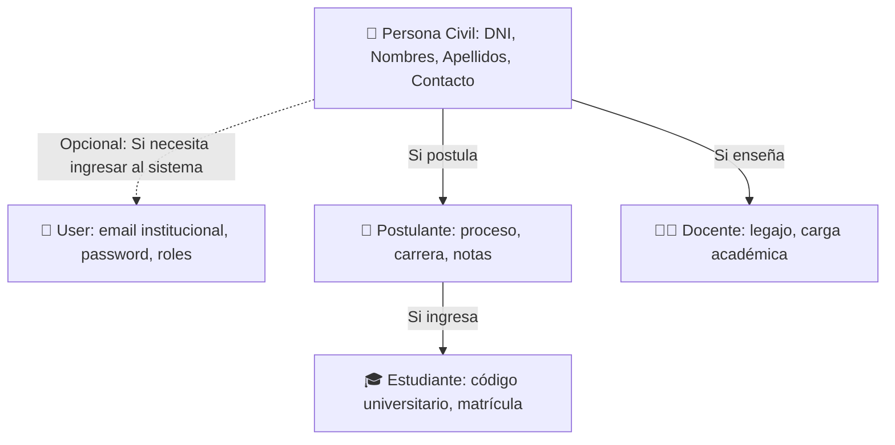

# 📘 Guía Rápida para Desarrolladores — ERP Instituto

> **¡Bienvenido al ERP Instituto!**  
> Esta guía está diseñada para que cualquier programador nuevo pueda entender todo el sistema en menos de 10 minutos y comenzar a desarrollar nuevas funcionalidades con facilidad, orden y escalabilidad.

---

## 🧭 1. El Mapa Mental del Proyecto (En 1 minuto)

El ERP es un **Monorepo Híbrido** muy sencillo de entender:

```
[ Frontend: React 19 + MUI + Vite ]
         │  (Peticiones HTTP JSON con Axios)
         ▼
[ Backend: Laravel 13 API REST + Sanctum ]
         │  (Consultas SQL con Eloquent ORM)
         ▼
[ Base de Datos: PostgreSQL (Producción / Local) | SQLite (Tests) ]
```

* **Frontend**: Una Single Page Application (SPA) moderna, ultra rápida y reactiva en `frontend/`.
* **Backend**: Una API REST limpia y modular en `backend/` que gestiona seguridad, lógica de negocio y base de datos.
* **Todo en un solo comando**: Al ejecutar `composer run dev` (o `npm run dev`), se levanta automáticamente Laravel en el puerto `8000` y Vite para el Frontend en simultáneo.

---

## 📂 2. ¿Dónde va cada cosa? (Estructura Clara y Didáctica)

Cuando quieras programar algo, sigue esta tabla:

| Lo que quieres hacer | Dónde se crea el archivo | Ejemplo real del proyecto |
|----------------------|--------------------------|---------------------------|
| **Crear una tabla en BD** | `backend/database/migrations/` | `2026_09_23_000001_create_personas_table.php` |
| **Poblar datos iniciales o de prueba** | `backend/database/seeders/` | `AdmisionSeeder.php`, `PermissionSeeder.php` |
| **Crear un Modelo de Datos (Eloquent)** | `backend/app/Models/` | `Persona.php`, `AdmisionProceso.php` |
| **Validar datos que llegan al API (Reglas)** | `backend/app/Http/Requests/` | `StoreAdmisionPostulacionRequest.php` |
| **Dar formato a la respuesta JSON** | `backend/app/Http/Resources/` | `AdmisionPostulacionResource.php` |
| **Lógica del Endpoint (Controlador)** | `backend/app/Http/Controllers/Api/` | `AdmisionProcesoController.php` |
| **Registrar la URL del Endpoint** | `backend/routes/api.php` | `Route::prefix('admision')->...` |
| **Crear cliente API en Frontend (Axios)** | `frontend/src/services/` | `admissionService.js` |
| **Crear una Pantalla o Vista (React)** | `frontend/src/pages/<modulo>/` | `frontend/src/pages/admission/AdmissionDashboard.jsx` |
| **Agregar la ruta en el Frontend** | `frontend/src/app.jsx` | `<Route path="/admission" element={<AdmissionDashboard />} />` |
| **Agregar el botón al Menú Lateral** | `frontend/src/layouts/DashboardLayout.jsx` | `{ text: 'Admisión', icon: <Award />, path: '/admission' }` |
| **Colores institucionales centralizados** | `frontend/src/theme/colors.js` | `THEME_COLORS.primary`, `THEME_COLORS.success` |

---

## 👤 3. El Modelo de Personas y Usuarios (Sin Enredos)

Para evitar duplicar nombres, DNI o teléfonos en cada módulo, el ERP tiene una regla muy simple:



1. **`Persona`**: Es el ser humano en la vida real. Tiene su DNI, nombres y apellidos únicos en la institución.
2. **`User`**: Es la cuenta digital para iniciar sesión en la web.
3. **`Postulante`**, **`Estudiante`**, **`Docente`**: Son los roles que esa misma persona desempeña a lo largo del tiempo. ¡Jamás duplicamos sus datos personales!

---

## 🔒 4. Seguridad, Roles y Permisos en 30 Segundos

* **Autenticación**: Se maneja con **Laravel Sanctum**. Cuando el usuario inicia sesión en `/api/auth/login`, recibe un `token` que el frontend guarda en `localStorage`.
* **Roles**: Roles generales como `superadmin` (acceso total automático), `admin`, `docente`, `estudiante`.
* **Permisos**: Tienen formato de jerarquía: `modulo.recurso.accion`.
  * *Ejemplo*: `admision.postulantes.ver`, `admision.postulantes.inscribir`, `usuarios.usuarios.crear`.
* **Cómo proteger una ruta en Backend**:
  ```php
  Route::get('/postulaciones', [AdmisionPostulacionController::class, 'index'])
      ->middleware('permission:admision.postulantes.ver');
  ```
* **Cómo proteger una vista en Frontend**:
  ```jsx
  <Route element={<ProtectedRoute requiredRoles={['superadmin', 'admin']} />}>
      <Route path="/admission" element={<AdmissionDashboard />} />
  </Route>
  ```

---

## 🚀 5. Tutorial Práctico: Cómo Crear un Nuevo Módulo en 5 Pasos

Supongamos que vas a crear el módulo de **Cursos / Asignaturas**:

### Paso 1: Base de Datos y Modelo
Crea la migración y el modelo en Laravel:
```bash
# 1. Crear migración
php artisan make:migration create_cursos_table
```
En el archivo de migración (`backend/database/migrations/...`):
```php
Schema::create('cursos', function (Blueprint $table) {
    $table->id();
    $table->string('codigo', 20)->unique();
    $table->string('nombre', 150);
    $table->integer('creditos')->default(3);
    $table->boolean('is_active')->default(true);
    $table->timestamps();
});
```
En el modelo (`backend/app/Models/Curso.php`):
```php
namespace App\Models;
use Illuminate\Database\Eloquent\Model;

class Curso extends Model {
    protected $fillable = ['codigo', 'nombre', 'creditos', 'is_active'];
}
```

### Paso 2: Controlador y Validación
En `backend/app/Http/Controllers/Api/CursoController.php`:
```php
namespace App\Http\Controllers\Api;
use App\Http\Controllers\Controller;
use App\Models\Curso;
use Illuminate\Http\Request;

class CursoController extends Controller {
    public function index() {
        return response()->json(['data' => Curso::all()]);
    }
    
    public function store(Request $request) {
        $validated = $request->validate([
            'codigo' => 'required|unique:cursos,codigo',
            'nombre' => 'required|string|max:150',
            'creditos' => 'required|integer|min:1',
        ]);
        $curso = Curso::create($validated);
        return response()->json(['message' => 'Curso creado con éxito', 'data' => $curso], 201);
    }
}
```

### Paso 3: Conectar la Ruta en `backend/routes/api.php`
```php
Route::middleware(['auth:sanctum'])->prefix('cursos')->group(function () {
    Route::get('/', [CursoController::class, 'index']);
    Route::post('/', [CursoController::class, 'store']);
});
```

### Paso 4: Crear el Servicio en Frontend (`frontend/src/services/cursoService.js`)
```javascript
import api from './api';

export const cursoService = {
    getCursos: async () => {
        const response = await api.get('/cursos');
        return response.data;
    },
    createCurso: async (data) => {
        const response = await api.post('/cursos', data);
        return response.data;
    },
};
```

### Paso 5: Crear la Vista React y Agregarla al Menú
1. Crea tu pantalla en `frontend/src/pages/cursos/CursosList.jsx` usando componentes de Material UI y colores `THEME_COLORS`.
2. En `frontend/src/app.jsx`:
   ```jsx
   import CursosList from './pages/cursos/CursosList';
   // Dentro de las rutas protegidas:
   <Route path="/cursos" element={<CursosList />} />
   ```
3. En `frontend/src/layouts/DashboardLayout.jsx`:
   ```jsx
   {
       text: 'Cursos y Asignaturas',
       icon: <BookOpen size={20} />,
       path: '/cursos',
       show: hasRole('superadmin') || hasRole('admin'),
   }
   ```
¡Y listo! Tu nuevo módulo está 100% conectado, protegido y funcionando.

---

## 🎨 6. Buenas Prácticas de Interfaz (UI)

Para que todo el ERP se vea profesional, uniforme y limpio:

1. **Colores Centralizados**: Importa siempre los colores desde `@/theme/colors`:
   ```javascript
   import { THEME_COLORS } from '../../theme/colors';
   // THEME_COLORS.primary, THEME_COLORS.success, THEME_COLORS.error, etc.
   ```
2. **Componentes Material UI (MUI)**: Usa `Container`, `Paper`, `Table`, `Dialog`, `TextField`, `Button`, `Chip`, `Alert`.
3. **Iconos**: Usa siempre **Lucide React** (`import { Plus, Search, Edit, Trash } from 'lucide-react'`).

---

## 🛠️ 7. Comandos Más Usados

| Comando | Qué hace |
|---------|----------|
| `composer run dev` | Inicia backend (Laravel en 8000) y frontend (Vite en 5173/HMR) juntos. |
| `composer test` | Ejecuta la suite de pruebas automatizadas (31 tests en SQLite en memoria). |
| `php artisan migrate` | Aplica nuevas migraciones a PostgreSQL. |
| `php artisan db:seed` | Llena la base de datos con los datos maestros y de prueba. |
| `npx vite build` (dentro de `frontend/`) | Compila el frontend para producción. |

---

## 💡 8. ¿Tienes Dudas o Algo Falla?

* **"No conecta el frontend al backend"**: Verifica que en tu archivo `.env` en la raíz exista la línea:
  `VITE_API_URL=http://localhost:8000/api`
  y que `frontend/vite.config.js` tenga `envDir: '../'`.
* **"Quiero ver la documentación técnica profunda"**:
  - Para reglas de BD y arquitectura: [docs/02-architecture.md](docs/02-architecture.md) y [docs/09-database-audit-actual.md](docs/09-database-audit-actual.md).
  - Para el flujo de desarrollo SDD: [docs/08-sdd-workflow.md](docs/08-sdd-workflow.md).

