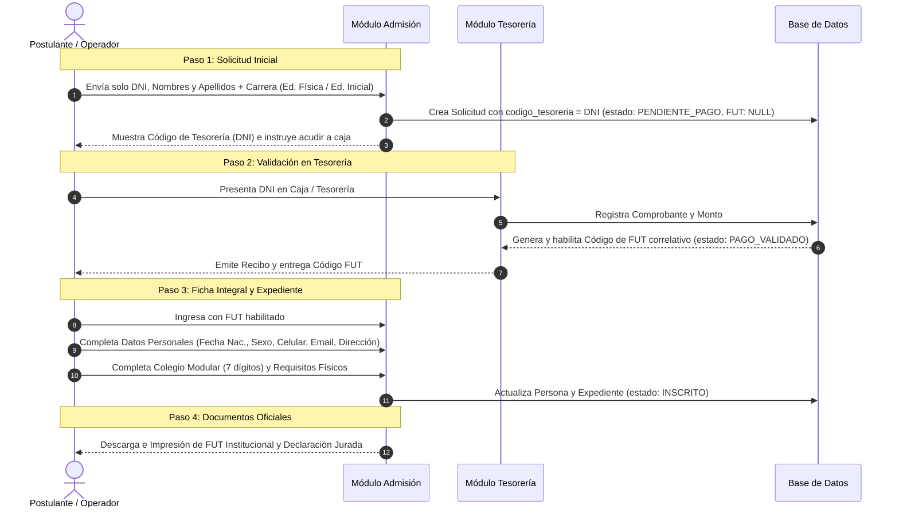

# SPEC — Convocatorias de Admisión, Módulo de Tesorería y Reformulación del Flujo de Inscripción

| Metadato | Detalle |
|----------|---------|
| **Módulos Afectados** | 08 — Admisión, 05 — Tesorería / Cuentas por Cobrar |
| **Fecha de Creación** | 2026-10-01 |
| **Estado** | APROBADO PARA IMPLEMENTACIÓN |
| **Prioridad** | ALTA |
| **Autores** | Equipo de Desarrollo ERP Instituto |

---

## 1. Contexto y Objetivos

A partir de la retroalimentación institucional y las necesidades operativas del Instituto de Educación Superior Pedagógico Público (IESPP), se requiere:

1. **Control de Convocatorias**:
   - Administrar los estados de la convocatoria: **Convocatoria Abierta** y **Convocatoria Cerrada**.
   - Crear nuevas convocatorias directamente desde la interfaz administrativa.
   - Restringir la oferta académica exclusivamente a los **dos (02) programas de estudio institucionales autorizados**:
     - **Educación Inicial** (Código: `EI-01`)
     - **Educación Física** (Código: `EF-01`)
   - Bloquear nuevas solicitudes de inscripción cuando una convocatoria se encuentre **Cerrada**.

2. **Creación del Módulo de Tesorería y Flujo de Código FUT**:
   - Disponer de un **Módulo de Tesorería** dedicado para que el personal de caja/finanzas consulte los postulantes por su **código de tesorería (que es su propio DNI)** y registre el abono por derecho de examen de admisión.
   - El sistema emite y **habilita el Código de FUT (Formulario Único de Trámite)** oficial únicamente tras la confirmación del pago en Tesorería.
   - Sin el Código de FUT emitido, no se permite continuar con el proceso ni completar el expediente.

3. **Redefinición del Ingreso de Datos**:
   - **Fase de Solicitud Inicial**: Para generar el código de Tesorería (DNI), **únicamente se deben enviar los datos básicos de identidad**:
     - Tipo y Número de Documento (DNI).
     - Nombres.
     - Apellido Paterno.
     - Apellido Materno.
     - Programa de estudios seleccionado (Educación Inicial o Educación Física).
   - **Fase Posterior a Tesorería**: Una vez obtenido y habilitado el Código de FUT en Tesorería, **recién se completan los demás datos personales y el expediente**:
     - Datos personales complementarios: Sexo, Fecha de Nacimiento, Celular, Correo Electrónico, Domicilio / Dirección.
     - Datos de procedencia escolar: Colegio de egreso, Código Modular (7 dígitos del MINEDU), Año de egreso, Tipo de gestión y Ubigeo.
     - Verificación de requisitos documentarios físicos (Foto, Copia DNI color, Partida de nacimiento, Certificado original).

4. **Reformulación y Profesionalización del Flujo**:
   - Eliminar de raíz términos informales o erróneos como "inscripción Ofial" o expresiones afines.
   - Utilizar terminología oficial: "Registro de Solicitud de Admisión", "Validación de Pago en Tesorería & Emisión de FUT", "Ficha Integral de Datos Personales y Expediente Académico", "Padrón Oficial de Postulantes".

---

## 2. Requerimientos Funcionales Detallados

### 2.1 Gestión y Control de Convocatorias
- **RF-ADM-01: Creación de Convocatoria**: Permite crear un nuevo proceso/convocatoria indicando: Período Académico, Código (`ADM-YYYY-X`), Nombre descriptivo, Fechas (inicio/fin de inscripción, evaluación, resultados) y Puntaje mínimo aprobatorio.
- **RF-ADM-02: Programas Exclusivos**: Al crear la convocatoria o listar oferta, se configuran automáticamente y exclusivamente las vacantes para **Educación Inicial** y **Educación Física**.
- **RF-ADM-03: Control de Estado Abierta/Cerrada**:
  - Estado `CONVOCATORIA_ABIERTA`: Permite recepción de nuevas solicitudes.
  - Estado `CONVOCATORIA_CERRADA`: Bloquea nuevas solicitudes tanto en frontend como con validación en backend (HTTP 422).
  - Acción rápida de cambio de estado (Toggle) con indicador visual (Chip verde / rojo).

### 2.2 Módulo de Tesorería & Emisión de FUT
- **RF-TES-01: Consulta de Cobranzas por DNI**: El cajero busca por número de DNI (código de tesorería) o nombre del postulante.
- **RF-TES-02: Registro y Validación de Pago**: Se registra el N° de comprobante (boleta o recibo de caja), monto (ej. S/ 150.00), fecha y método de pago.
- **RF-TES-03: Emisión Inmediata de Código FUT**: Al validar el pago, el backend genera correlativamente el `numero_fut` (`FUT-{año}-{correlativo}`), marca `estado_pago = 'PAGADO'` y habilita la prosecución del trámite.
- **RF-TES-04: Panel de Control de Recaudación**: Dashboard de tesorería con métricas (total recaudado, pagos pendientes, pagos validados) y tabla filtrable por estado.

### 2.3 Secuencia del Flujo de Admisión Reformulado

---

## 3. Modelo de Datos y Reglas de Negocio

### 3.1 Entidades Involucradas
1. `admision_procesos`:
   - `estado`: `CONVOCATORIA_ABIERTA` | `CONVOCATORIA_CERRADA`.
2. `admision_programas_ofertados`:
   - Solo dos programas asociados por convocatoria:
     - `EI-01` (Educación Inicial)
     - `EF-01` (Educación Física)
3. `admision_postulaciones`:
   - `codigo_tesoreria`: DNI del postulante.
   - `estado_pago`: `PENDIENTE` | `PAGADO`.
   - `numero_fut`: Identificador oficial único (generado al confirmar pago).
   - `estado_inscripcion`: `PENDIENTE_PAGO` -> `PAGO_VALIDADO` -> `INSCRITO`.
4. `personas`:
   - Datos básicos (DNI, nombres, apellidos) creados en Fase 1.
   - Datos complementarios (fecha nacimiento, sexo, celular, email, dirección) completados en Fase 3 tras validación de FUT.

---

## 4. Endpoints de la API

### Convocatorias (`/api/admision/procesos`)
- `GET /api/admision/procesos`: Lista convocatorias.
- `POST /api/admision/procesos`: Crea nueva convocatoria con los 2 programas autorizados.
- `GET /api/admision/procesos/{id}`: Detalle de convocatoria y vacantes.
- `PATCH /api/admision/procesos/{id}/toggle-estado`: Alterna entre abierta y cerrada.

### Tesorería (`/api/tesoreria/pagos-admision`)
- `GET /api/tesoreria/pagos-admision`: Lista cobranzas con filtros y búsqueda por DNI.
- `GET /api/tesoreria/pagos-admision/consultar/{dni}`: Búsqueda rápida de deuda por DNI.
- `POST /api/tesoreria/pagos-admision/{postulacion}/registrar-pago`: Registra cobro y emite número de FUT.

### Flujo de Admisión (`/api/admision/postulaciones`)
- `GET /api/admision/postulaciones/consultar-dni/{dni}`: Consulta postulación existente o persona para reanudar el flujo sin duplicidades.
- `POST /api/admision/postulaciones/pre-inscribir`: Registra o reanuda solicitud con DNI, Nombres y Apellidos; genera Código de Tesorería (DNI). No obliga a seleccionar carrera en la fase inicial.
- `POST /api/admision/postulaciones/{id}/validar-pago`: Permite registrar pago y emitir FUT.
- `POST /api/admision/postulaciones/{id}/completar-expediente`: Requiere que el pago esté validado y exista FUT; guarda especialidad elegida, datos personales complementarios y expediente académico.
- `GET /api/admision/postulaciones/{id}/fut-documento`: Estructura para FUT.
- `GET /api/admision/postulaciones/{id}/declaracion-jurada`: Estructura para Declaración Jurada.

---

## 5. Experiencia de Usuario y Navegación

1. **Menú Lateral y Barra Superior**:
   - Fondo institucional en **Azul Oscuro** (`#0f172a`).
   - Navegación optimizada mediante elementos colapsables / acordeón para:
     - **Usuarios y Roles** (Gestión de Usuarios, Gestión de Roles).
     - **Admisión** (Padrón de Postulantes, Inscripción de Postulantes, Gestión de Convocatorias, Vacantes Ofertadas, Cuadro de Mérito).
     - **Tesorería** (Módulo de Tesorería y Cobranzas).

2. **Pantalla Dedicada de Inscripción (`/admission/inscribir`)**:
   - Barra superior azul oscuro con título `+ Registro de Postulante`.
   - Stepper horizontal con 6 pasos:
     1. Datos (Información Personal con botón RENIEC).
     2. Foto (Imagen de Perfil).
     3. Especialidad (Carrera Profesional: Inicial o Educación Física).
     4. Colegio (Institución Educativa con Código Modular).
     5. Documentos (Requisitos Físicos).
     6. Pago (Voucher / Monto & Formatos Oficiales A4).
   - Botón "Continuar Inscripción" en el Padrón de Postulantes para reanudar trámites en proceso en cualquier momento.
