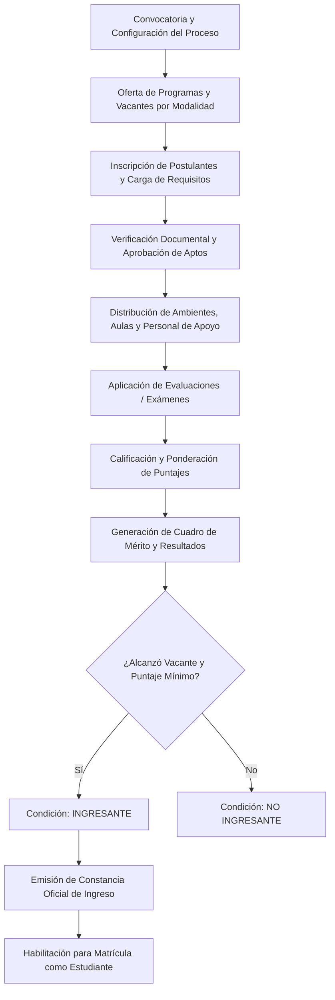
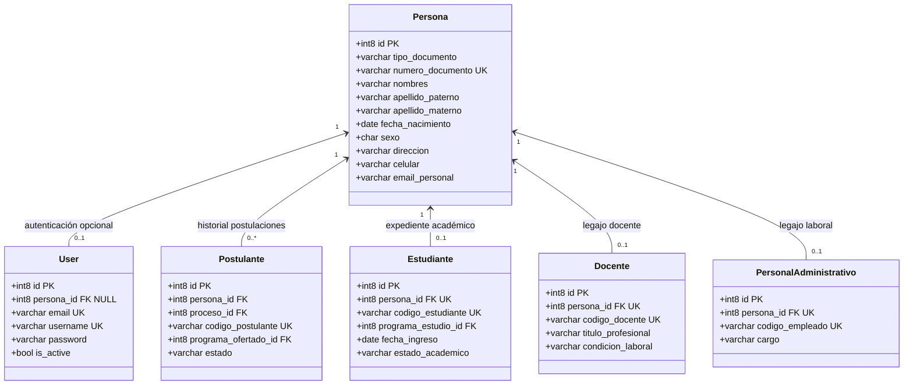
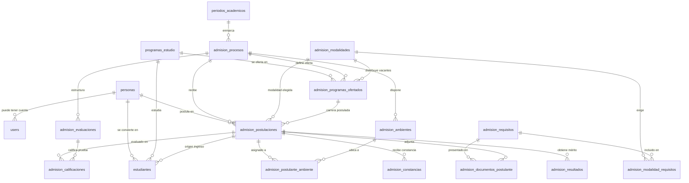

# SPEC: Evolución de Base de Datos para el Módulo de Admisión y Entidad Transversal Persona

> **Módulo**: Admisión (Módulo 08) & Arquitectura Transversal de Persistencia  
> **Estado**: En Revisión (Fase de Análisis y Diseño — Pendiente de Aprobación)  
> **Fecha**: Septiembre 2026  
> **Autor**: Antigravity AI (Pair Programming)  
> **Normativa de Referencia**: Lineamientos para Procesos de Admisión en IESP (MINEDU / DIFOID - Perú)

---

## 1. Contexto y Objetivos

### 1.1 Contexto
El ERP Instituto para Instituciones de Educación Superior Pedagógica (IESP) necesita incorporar el **Módulo de Admisión**. Este módulo no opera de forma aislada: representa la **puerta de entrada de los futuros estudiantes a la institución**.

Para que la base de datos no sufra parches temporales ni duplicaciones destructivas, este documento establece el **análisis de dominio del proceso de admisión**, la **resolución arquitectónica de la entidad `Persona`**, y la **propuesta formal del modelo de datos evolutivo**.

### 1.2 Objetivos
1. Definir el modelo integral del proceso de admisión cubriendo desde la convocatoria hasta la constancia de ingreso.
2. Resolver de manera justificada la representación de `Persona` y su desacoplamiento de `User`, `Postulante`, `Estudiante` y `Docente`.
3. Establecer el flujo de transición **Postulante → Ingresante → Estudiante** preservando el valor histórico y legal de las actas de admisión.
4. Garantizar 100% de compatibilidad hacia atrás con el núcleo existente de usuarios y roles RBAC en PostgreSQL.

---

## 2. Fase 2: Análisis Integral del Dominio de Admisión

En las IESP peruanas, el proceso de admisión es un evento regulado por el MINEDU que involucra etapas administrativas, académicas y de auditoría estricta.



### 2.1 Componentes y Flujos del Dominio

#### 1. Proceso / Periodo de Admisión
- Convocatoria institucional (ej. *"Admisión Ordinaria 2026-I"*).
- Vigencia temporal: fecha de inicio, fin de inscripciones, fecha de evaluación y cierre.
- Estado del proceso: `PLANIFICADO`, `CONVOCATORIA_ABIERTA`, `INSCRIPCIONES_CERRADAS`, `EN_EVALUACION`, `RESULTADOS_PUBLICADOS`, `FINALIZADO`.

#### 2. Modalidades de Admisión
- **Ordinario**: Evaluación de competencias fundamentales (matemática, comunicación, cultura) y prueba de aptitud pedagógica/vocacional.
- **Extraordinario / Exonerados**: Primeros puestos de educación secundaria, deportistas calificados, comunidades nativas/campesinas, beneficiarios de leyes especiales (PIR/VRAEM), traslados externos o titulados.

#### 3. Programas Ofertados y Vacantes
- Relaciona el Proceso de Admisión con los **Programas de Estudios** de la institución (Educación Inicial, Primaria, Secundaria en sus especialidades, etc.).
- Distribución de vacantes: número de cupos asignados a cada programa por modalidad específica.

#### 4. Requisitos y Documentación
- Catálogo de requisitos obligatorios según la modalidad (ej. DNI vigente, Certificado de estudios secundarios completos, Partida de nacimiento, Declaración jurada de no antecedentes penales, Comprobante de pago de derecho de admisión).
- Control de estado de cada documento por postulante: `PENDIENTE`, `OBSERVADO`, `SUBSANADO`, `VALIDADO`.

#### 5. Postulante e Inscripción
- Asignación de código único de postulante (ej. `POST-20261-0012`).
- Elección del programa de estudios (opción principal y opcionalmente segunda opción).
- Estado de la postulación: `REGISTRADO`, `OBSERVADO`, `APTO_EVALUACION`, `NO_APTO`.

#### 6. Ambientes y Personal de Apoyo
- **Ambientes**: Aulas, auditorios o laboratorios del local institucional donde se rendirá la prueba presencial, con aforo máximo controlado.
- **Asignación de postulantes**: Distribución equitativa y ordenada de postulantes en aulas.
- **Personal de apoyo**: Docentes o administrativos asignados al rol de coordinadores de pabellón, jurados de entrevista o aplicadores/cuidadores de aula.

#### 7. Evaluaciones, Preguntas y Calificaciones
- Tipos de evaluación según modalidad:
  - Prueba de Competencias Fundamentales (conocimientos).
  - Prueba de Aptitud Vocacional.
  - Entrevista Personal / Evaluación de Habilidades Blandas.
  - Evaluación de Expediente (para modalidades extraordinarias).
- Ponderaciones porcentuales (ej. 60% examen de conocimientos, 20% vocacional, 20% entrevista).
- Puntaje mínimo aprobatorio institucional.
- Registro de calificaciones por fase/criterio y cálculo del puntaje final ponderado.

#### 8. Resultados, Cuadro de Mérito y Actas
- Generación automatizada del **Cuadro de Mérito** ordenado de mayor a menor puntaje ponderado.
- Adjudicación estricta por estricto orden de mérito hasta agotar las vacantes ofertadas.
- Condición final del postulante:
  - `INGRESANTE`: Alcanzó vacante dentro del cupo del programa.
  - `NO_INGRESANTE`: Aprobó pero no alcanzó vacante por cupo insuficiente, o no alcanzó el puntaje mínimo.
  - `NO_SE_PRESENTO`: Postulante ausente en una o más fases eliminatorias.
  - `DESCALIFICADO`: Infracción al reglamento de admisión (suplantación, plagio).
- Emisión de Acta Oficial de Resultados (documento legal inmutable requerido para elevar a la DRE/MINEDU).

#### 9. Constancia de Ingreso y Transición al Módulo Académico
- Emisión de la **Constancia de Ingreso** con código único y mecanismo de verificación para el postulante que alcanzó vacante.
- Con dicha constancia, el ingresante queda expedito para el proceso de **Matrícula** en el Módulo Académico, donde se crea su expediente como **Estudiante**.
- **Información que debe conservarse permanentemente**: El expediente de admisión (puntajes, respuestas, actas, documentos presentados) jamás se destruye; permanece archivado como evidencia histórica del ingreso.

---

## 3. Fase 3: Análisis Arquitectónico de la Entidad Persona

### 3.1 La Pregunta Fundamental
> ¿Debe el ERP Instituto contar con una entidad transversal `Persona` como base de todas las identidades humanas del sistema?

Para responder con rigor, evaluamos tres alternativas arquitectónicas:

---

### 3.2 Alternativas Evaluadas

#### ❌ Alternativa B (Descartada): `users` como entidad central de todo el ERP
- **Enfoque**: La tabla `users` almacena todos los datos personales de cualquier ser humano (postulantes, estudiantes, docentes, administrativos, apoderados).
- **Por qué se descarta**:
  1. *Polución de Cuentas de Acceso*: Un proceso de admisión puede tener 800 postulantes de los cuales solo ingresan 90. Crear un `user` con credenciales de autenticación para cada persona que solo postula genera miles de cuentas inactivas en la tabla de seguridad.
  2. *Mezcla de responsabilidades*: Se mezcla la **identidad digital** (login, password, tokens, MFA) con la **identidad civil** (DNI, partida de nacimiento, dirección, datos biográficos).
  3. *Incompatibilidad de ciclo de vida*: Una cuenta de usuario puede deshabilitarse o eliminarse, pero la persona y sus registros históricos (actas de notas, constancias) deben permanecer en la BD.

#### ❌ Alternativa C (Descartada): Tablas Aisladas sin Entidad Común (`postulantes`, `estudiantes`, `docentes`)
- **Enfoque**: Cada módulo crea su propia tabla independiente con sus propios campos (`dni`, `nombres`, `apellidos`, `celular`, etc.).
- **Por qué se descarta**:
  1. *Duplicación masiva de datos*: Si Juan Pérez postula en 2026-I, sus datos van a `postulantes`. Si ingresa, sus datos se copian a `estudiantes`. Si más adelante egresa y es contratado como docente, sus datos se copian a `docentes`. Si actualiza su número de celular o dirección, los módulos quedan desincronizados.
  2. *Pérdida de Integridad Referencial*: Es imposible consultar en un solo lugar la trayectoria completa de una persona en la institución.
  3. *Inconsistencias en DNI y Nombres*: Errores tipográficos en un módulo impiden cruzar información con otros módulos (ej. Cuentas por Cobrar vs Biblioteca vs Académico).

####  Alternativa A (Recomendada): Entidad Transversal `personas` con Roles de Dominio Especializados
- **Enfoque**: Se crea la tabla central `personas` que almacena los datos de identidad civil de la persona física (única fuente de verdad). Las demás entidades se vinculan mediante relaciones de clave foránea `persona_id`.



### 3.3 El Flujo Crítico: Postulante → Ingresante → Estudiante

El diseño resuelve con total elegancia y rigor legal la transición:

1. **Inscripción (Persona → Postulante)**:
   - Se registra o busca a la persona por su DNI en la tabla `personas`.
   - Se crea el registro en `admision_postulaciones` con `persona_id` y `proceso_id`.
   - La persona puede postular en múltiples convocatorias a lo largo de los años sin duplicar su identidad civil.

2. **Evaluación y Calificación**:
   - Todas las calificaciones, actas y méritos se asocian a `admision_postulaciones`.

3. **Publicación y Adjudicación (Ingresante)**:
   - Si alcanza vacante, el campo `admision_postulaciones.condicion` cambia a `INGRESANTE`.
   - Se genera el registro en `admision_constancias`.
   - **El registro de postulación queda congelado e inmutable para siempre en el archivo histórico de admisión**.

4. **Matrícula y Conversión a Estudiante (Ingresante → Estudiante)**:
   - En el Módulo Académico, Secretaría Académica ratifica el ingreso y crea el registro en la tabla `estudiantes`.
   - `estudiantes` apunta a `persona_id` (la misma persona física) y a `admision_postulacion_id` (trazabilidad del ingreso).
   - Se le asigna su **Código de Estudiante** oficial (ej. `2026-I-0104`).
   - Se le puede crear opcionalmente una cuenta en `users` vinculada a `persona_id` y asignarle el rol `estudiante` para que acceda al portal web.

---

## 4. Fase 4: Propuesta Formal de Base de Datos para Admisión

### 4.1 Clasificación de Estructuras

| Categoría | Tablas / Entidades |
|-----------|--------------------|
| **Existente & Conservar (Intactas)** | `users`, `roles`, `permissions`, `role_user`, `permission_role`, `permission_user`, `personal_access_tokens`, `sessions`, `password_reset_tokens`, `cache`, `jobs`. |
| **Modificar (No destructivo)** | `users` (adición opcional de `persona_id` FK nullable); regularización del registro huérfano de Batch 2 en `migrations`. |
| **Crear — Transversal Base** | `personas` (entidad maestra civil). |
| **Crear — Catálogos Académicos Previos** | `programas_estudio` (carreras pedagógicas institucionales), `periodos_academicos` (periodos lectivos). |
| **Crear — Módulo de Admisión** | `admision_procesos`, `admision_modalidades`, `admision_programas_ofertados`, `admision_requisitos`, `admision_modalidad_requisitos`, `admision_postulaciones`, `admision_documentos_postulante`, `admision_ambientes`, `admision_postulante_ambiente`, `admision_evaluaciones`, `admision_calificaciones`, `admision_resultados`, `admision_constancias`. |
| **Crear — Módulo Académico (Transición)** | `estudiantes` (vinculado a `persona_id`, `programa_estudio_id` y opcionalmente a la postulación de origen). |

---

### 4.2 Modelo Relacional Propuesto (Diagrama Completo de Admisión)



---

### 4.3 Especificación de Nuevas Tablas

#### 1. Entidad Transversal: `personas`
```sql
CREATE TABLE personas (
    id BIGSERIAL PRIMARY KEY,
    tipo_documento VARCHAR(20) NOT NULL DEFAULT 'DNI', -- DNI, CE, PASAPORTE
    numero_documento VARCHAR(20) NOT NULL UNIQUE,
    nombres VARCHAR(100) NOT NULL,
    apellido_paterno VARCHAR(100) NOT NULL,
    apellido_materno VARCHAR(100) NOT NULL,
    fecha_nacimiento DATE NULL,
    sexo CHAR(1) NULL, -- 'M', 'F'
    direccion VARCHAR(255) NULL,
    celular VARCHAR(20) NULL,
    email_personal VARCHAR(150) NULL,
    is_active BOOLEAN NOT NULL DEFAULT TRUE,
    created_at TIMESTAMP NULL,
    updated_at TIMESTAMP NULL,
    deleted_at TIMESTAMP NULL
);
CREATE INDEX idx_personas_doc ON personas(numero_documento);
CREATE INDEX idx_personas_nombres ON personas(apellido_paterno, apellido_materno, nombres);
```

#### 2. Catálogos Base: `programas_estudio` y `periodos_academicos`
```sql
CREATE TABLE programas_estudio (
    id BIGSERIAL PRIMARY KEY,
    codigo VARCHAR(20) NOT NULL UNIQUE, -- ej. 'EI-2026'
    nombre VARCHAR(150) NOT NULL, -- ej. 'Educación Inicial'
    nivel_academico VARCHAR(50) NOT NULL DEFAULT 'Pregrado',
    duracion_semestres INT NOT NULL DEFAULT 10,
    is_active BOOLEAN NOT NULL DEFAULT TRUE,
    created_at TIMESTAMP NULL,
    updated_at TIMESTAMP NULL
);

CREATE TABLE periodos_academicos (
    id BIGSERIAL PRIMARY KEY,
    codigo VARCHAR(20) NOT NULL UNIQUE, -- ej. '2026-I'
    nombre VARCHAR(100) NOT NULL, -- ej. 'Periodo Académico 2026-I'
    fecha_inicio DATE NOT NULL,
    fecha_fin DATE NOT NULL,
    is_vigente BOOLEAN NOT NULL DEFAULT FALSE,
    created_at TIMESTAMP NULL,
    updated_at TIMESTAMP NULL
);
```

#### 3. Procesos y Modalidades de Admisión
```sql
CREATE TABLE admision_procesos (
    id BIGSERIAL PRIMARY KEY,
    periodo_academico_id BIGINT NOT NULL REFERENCES periodos_academicos(id),
    nombre VARCHAR(150) NOT NULL, -- ej. 'Proceso de Admisión Ordinario e Institucional 2026-I'
    codigo VARCHAR(30) NOT NULL UNIQUE, -- ej. 'ADM-2026-1'
    fecha_inicio_inscripcion DATE NOT NULL,
    fecha_fin_inscripcion DATE NOT NULL,
    fecha_evaluacion DATE NOT NULL,
    fecha_publicacion_resultados DATE NOT NULL,
    puntaje_minimo_aprobatorio DECIMAL(5,2) NOT NULL DEFAULT 11.00,
    estado VARCHAR(30) NOT NULL DEFAULT 'PLANIFICADO', 
    -- 'PLANIFICADO', 'CONVOCATORIA_ABIERTA', 'INSCRIPCIONES_CERRADAS', 'EN_EVALUACION', 'FINALIZADO'
    created_at TIMESTAMP NULL,
    updated_at TIMESTAMP NULL
);

CREATE TABLE admision_modalidades (
    id BIGSERIAL PRIMARY KEY,
    nombre VARCHAR(100) NOT NULL, -- ej. 'Ordinario', 'Primeros Puestos', 'Deportistas Calificados'
    codigo VARCHAR(30) NOT NULL UNIQUE, -- ej. 'ORD', 'PP', 'DEP'
    descripcion TEXT NULL,
    tipo VARCHAR(30) NOT NULL DEFAULT 'ORDINARIO', -- 'ORDINARIO', 'EXTRAORDINARIO'
    is_active BOOLEAN NOT NULL DEFAULT TRUE,
    created_at TIMESTAMP NULL,
    updated_at TIMESTAMP NULL
);

CREATE TABLE admision_programas_ofertados (
    id BIGSERIAL PRIMARY KEY,
    admision_proceso_id BIGINT NOT NULL REFERENCES admision_procesos(id) ON DELETE CASCADE,
    programa_estudio_id BIGINT NOT NULL REFERENCES programas_estudio(id),
    admision_modalidad_id BIGINT NOT NULL REFERENCES admision_modalidades(id),
    vacantes INT NOT NULL DEFAULT 0,
    created_at TIMESTAMP NULL,
    updated_at TIMESTAMP NULL,
    CONSTRAINT uq_proceso_programa_modalidad UNIQUE (admision_proceso_id, programa_estudio_id, admision_modalidad_id)
);
```

#### 4. Requisitos de Admisión
```sql
CREATE TABLE admision_requisitos (
    id BIGSERIAL PRIMARY KEY,
    nombre VARCHAR(150) NOT NULL, -- ej. 'Certificado de Estudios de Secundaria'
    descripcion TEXT NULL,
    es_obligatorio BOOLEAN NOT NULL DEFAULT TRUE,
    formato_permitido VARCHAR(50) NOT NULL DEFAULT 'PDF', -- 'PDF', 'JPG', 'FISICO'
    is_active BOOLEAN NOT NULL DEFAULT TRUE,
    created_at TIMESTAMP NULL,
    updated_at TIMESTAMP NULL
);

CREATE TABLE admision_modalidad_requisitos (
    admision_modalidad_id BIGINT NOT NULL REFERENCES admision_modalidades(id) ON DELETE CASCADE,
    admision_requisito_id BIGINT NOT NULL REFERENCES admision_requisitos(id) ON DELETE CASCADE,
    PRIMARY KEY (admision_modalidad_id, admision_requisito_id)
);
```

#### 5. Postulaciones y Expediente Documentario
```sql
CREATE TABLE admision_postulaciones (
    id BIGSERIAL PRIMARY KEY,
    codigo_postulante VARCHAR(30) NOT NULL UNIQUE, -- ej. 'POST-20261-0001'
    persona_id BIGINT NOT NULL REFERENCES personas(id),
    admision_proceso_id BIGINT NOT NULL REFERENCES admision_procesos(id),
    admision_programa_ofertado_id BIGINT NOT NULL REFERENCES admision_programas_ofertados(id),
    fecha_inscripcion TIMESTAMP NOT NULL DEFAULT CURRENT_TIMESTAMP,
    estado_inscripcion VARCHAR(30) NOT NULL DEFAULT 'REGISTRADO', 
    -- 'REGISTRADO', 'OBSERVADO', 'APTO_EVALUACION', 'NO_APTO', 'ANULADO'
    observaciones TEXT NULL,
    created_at TIMESTAMP NULL,
    updated_at TIMESTAMP NULL,
    deleted_at TIMESTAMP NULL,
    CONSTRAINT uq_persona_proceso UNIQUE (persona_id, admision_proceso_id)
);

CREATE TABLE admision_documentos_postulante (
    id BIGSERIAL PRIMARY KEY,
    admision_postulacion_id BIGINT NOT NULL REFERENCES admision_postulaciones(id) ON DELETE CASCADE,
    admision_requisito_id BIGINT NOT NULL REFERENCES admision_requisitos(id),
    archivo_url VARCHAR(255) NULL, -- ruta en storage/app
    estado VARCHAR(30) NOT NULL DEFAULT 'PENDIENTE', -- 'PENDIENTE', 'OBSERVADO', 'VALIDADO'
    observacion TEXT NULL,
    validado_por_user_id BIGINT NULL REFERENCES users(id),
    fecha_validacion TIMESTAMP NULL,
    created_at TIMESTAMP NULL,
    updated_at TIMESTAMP NULL
);
```

#### 6. Ambientes, Aulas y Personal de Apoyo
```sql
CREATE TABLE admision_ambientes (
    id BIGSERIAL PRIMARY KEY,
    admision_proceso_id BIGINT NOT NULL REFERENCES admision_procesos(id) ON DELETE CASCADE,
    codigo_aula VARCHAR(30) NOT NULL, -- ej. 'AULA-101'
    pabellon VARCHAR(50) NULL,
    capacidad INT NOT NULL DEFAULT 30,
    responsable_user_id BIGINT NULL REFERENCES users(id), -- docente o personal de apoyo encargado
    created_at TIMESTAMP NULL,
    updated_at TIMESTAMP NULL
);

CREATE TABLE admision_postulante_ambiente (
    id BIGSERIAL PRIMARY KEY,
    admision_postulacion_id BIGINT NOT NULL REFERENCES admision_postulaciones(id) ON DELETE CASCADE,
    admision_ambiente_id BIGINT NOT NULL REFERENCES admision_ambientes(id) ON DELETE CASCADE,
    numero_asiento INT NULL,
    asistio BOOLEAN NULL, -- true = presente, false = ausente
    created_at TIMESTAMP NULL,
    updated_at TIMESTAMP NULL,
    CONSTRAINT uq_postulacion_ambiente UNIQUE (admision_postulacion_id)
);
```

#### 7. Evaluaciones, Calificaciones, Resultados y Constancias
```sql
CREATE TABLE admision_evaluaciones (
    id BIGSERIAL PRIMARY KEY,
    admision_proceso_id BIGINT NOT NULL REFERENCES admision_procesos(id) ON DELETE CASCADE,
    nombre VARCHAR(100) NOT NULL, -- ej. 'Prueba de Competencias Fundamentales', 'Entrevista Vocacional'
    peso_porcentual DECIMAL(5,2) NOT NULL, -- ej. 60.00 (%)
    puntaje_maximo DECIMAL(5,2) NOT NULL DEFAULT 20.00,
    orden INT NOT NULL DEFAULT 1,
    created_at TIMESTAMP NULL,
    updated_at TIMESTAMP NULL
);

CREATE TABLE admision_calificaciones (
    id BIGSERIAL PRIMARY KEY,
    admision_postulacion_id BIGINT NOT NULL REFERENCES admision_postulaciones(id) ON DELETE CASCADE,
    admision_evaluacion_id BIGINT NOT NULL REFERENCES admision_evaluaciones(id),
    puntaje DECIMAL(5,2) NOT NULL DEFAULT 0.00,
    evaluador_user_id BIGINT NULL REFERENCES users(id),
    created_at TIMESTAMP NULL,
    updated_at TIMESTAMP NULL,
    CONSTRAINT uq_postulacion_evaluacion UNIQUE (admision_postulacion_id, admision_evaluacion_id)
);

CREATE TABLE admision_resultados (
    id BIGSERIAL PRIMARY KEY,
    admision_postulacion_id BIGINT NOT NULL REFERENCES admision_postulaciones(id) ON DELETE CASCADE,
    puntaje_final DECIMAL(5,2) NOT NULL,
    orden_merito INT NOT NULL,
    condicion VARCHAR(30) NOT NULL, 
    -- 'INGRESANTE', 'NO_INGRESANTE', 'NO_SE_PRESENTO', 'DESCALIFICADO'
    es_adjudicado BOOLEAN NOT NULL DEFAULT FALSE,
    created_at TIMESTAMP NULL,
    updated_at TIMESTAMP NULL,
    CONSTRAINT uq_resultado_postulacion UNIQUE (admision_postulacion_id)
);

CREATE TABLE admision_constancias (
    id BIGSERIAL PRIMARY KEY,
    admision_postulacion_id BIGINT NOT NULL REFERENCES admision_postulaciones(id),
    codigo_constancia VARCHAR(50) NOT NULL UNIQUE, -- ej. 'CONST-ING-20261-0004'
    fecha_emision DATE NOT NULL DEFAULT CURRENT_DATE,
    hash_seguridad VARCHAR(100) NOT NULL, -- para validación QR / firma digital
    emitido_por_user_id BIGINT NOT NULL REFERENCES users(id),
    created_at TIMESTAMP NULL,
    updated_at TIMESTAMP NULL
);
```

#### 8. Enlace al Módulo Académico: `estudiantes`
```sql
CREATE TABLE estudiantes (
    id BIGSERIAL PRIMARY KEY,
    persona_id BIGINT NOT NULL UNIQUE REFERENCES personas(id),
    programa_estudio_id BIGINT NOT NULL REFERENCES programas_estudio(id),
    admision_postulacion_id BIGINT NULL REFERENCES admision_postulaciones(id), -- trazabilidad del ingreso
    codigo_estudiante VARCHAR(30) NOT NULL UNIQUE, -- ej. '202610012'
    fecha_ingreso DATE NOT NULL,
    estado_academico VARCHAR(30) NOT NULL DEFAULT 'REGULAR', -- 'REGULAR', 'OBSERVADO', 'RESERVA', 'EGRESADO'
    is_active BOOLEAN NOT NULL DEFAULT TRUE,
    created_at TIMESTAMP NULL,
    updated_at TIMESTAMP NULL,
    deleted_at TIMESTAMP NULL
);
```

---

## 5. Decisiones Pendientes (Para Consulta y Aprobación del Usuario)

| # | Decisión Pendiente | Opciones Evaluadas | Recomendación Antigravity |
|---|-------------------|-------------------|---------------------------|
| 1 | **Detalle de Examen en BD** | **A:** Almacenar bancos de preguntas/respuestas dentro de Admisión.<br>**B:** Almacenar solo puntajes por fase/evaluación (fórmulas y actas consolidadas). | **Opción B (Recomendada)**: En Admisión IESP las pruebas impresas o cuadernillos se procesan y se sube el acta de calificaciones. Almacenar preguntas es excesivo para esta fase y pertenece a un módulo de banco de reactivos. |
| 2 | **Criterio de Desempate en Cuadro de Mérito** | **A:** Mayor puntaje en Prueba de Conocimientos.<br>**B:** Mayor nota en secundaria.<br>**C:** Orden cronológico de inscripción. | **Opción A (Recomendada)**: Estándar DIFOID/MINEDU: desempate por subprueba de competencias fundamentales (comunicación/matemática). |
| 3 | **Cuentas de Acceso para Postulantes** | **A:** Todo postulante recibe un usuario en `users` para consultar su ficha y resultados.<br>**B:** Los postulantes consultan su estado por DNI y código de postulante en una vista pública protegida por token temporal. | **Opción B (Recomendada)**: No saturar la tabla `users`. Solo los ingresantes ratificados reciben cuenta formal de usuario institucional. |

---

## 6. Análisis de Riesgos y Plan de Mitigación

| Riesgo | Probabilidad | Impacto | Estrategia de Mitigación |
|--------|--------------|---------|--------------------------|
| Registro huérfano de `2026_09_22_000001_create_students_table` en la tabla `migrations` | Alta | Medio | Regularizar la tabla `migrations` mediante un comando artisan o migración limpia sin alterar datos de usuarios ni roles. |
| Concurrencia masiva en consulta de resultados | Media | Alto | Implementar índices sobre `admision_postulaciones(codigo_postulante)` y `personas(numero_documento)` y cachear el cuadro de méritos final. |
| Inmutabilidad de actas de admisión ante reclamos | Media | Crítico | Las actas y calificaciones finales pasan a estado `FINALIZADO` y se bloquea su actualización en el controlador y mediante Policy. |

---

## 7. Próximos Pasos (Tras Aprobación del Usuario)

Siguiendo el flujo SDD:
1. **Aprobación del usuario** de esta SPEC y de la auditoría.
2. Generación del **PLAN de implementación** (`evolucion-bd-admision.plan.md`).
3. Generación del desglose de **TASKS** (`evolucion-bd-admision.tasks.md`).
4. Creación de las migraciones ordenadas en Laravel (`personas` primero, luego catálogos, luego admisión).
5. Seeders con datos peruanos de prueba para cada fase.
6. Desarrollo de controladores, Form Requests, Resources y vistas React.

---

*Fin de la especificación.*

