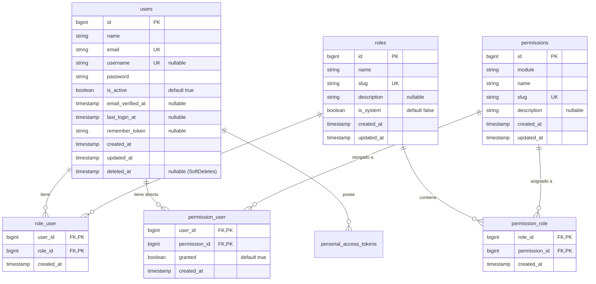

# Persistencia PostgreSQL + Núcleo de Identidad, Usuarios, Roles y Permisos

> **Módulo**: Núcleo Transversal (Infraestructura, Autenticación y Autorización)  
> **Estado**: completada  
> **Fecha**: Septiembre 2026  
> **Autor**: Antigravity AI / Equipo de Desarrollo  

---

## 1. Contexto

El **ERP Instituto** comprende 14 módulos funcionales interconectados (Académico, RRHH, Contabilidad, Tesorería, etc.). Actualmente, el repositorio cuenta con una configuración inicial de base de datos en SQLite sin modelos de dominio ni persistencia real configurada hacia un gestor de base de datos de producción, y carece de un sistema de control de acceso basado en roles y permisos (RBAC).

Para dar soporte ordenado y seguro a todos los módulos del ERP, se requiere:
1. Establecer la infraestructura de persistencia con **PostgreSQL**.
2. Diseñar el **núcleo de identidad, usuarios, roles y permisos**, asegurando que sea extensible, desacoplado de reglas de negocio prematuras y reutilizable por todos los módulos institucionales.

---

## 2. Objetivo

- Establecer la persistencia oficial sobre PostgreSQL garantizando compatibilidad con los estándares de Laravel 13.
- Modelar y estructurar el núcleo de identidad (`User`), roles (`Role`), permisos (`Permission`) y sus tablas intermedias de asignación (`role_user`, `permission_role`, `permission_user`).
- Proveer un mecanismo robusto de autenticación (Sanctum) y autorización (Gates / Policies / Middleware) que proteja los endpoints de la API y sirva de base a los 14 módulos.
- Dejar el esquema optimizado con claves foráneas, índices y migraciones idempotentes listas para PostgreSQL.

---

## 3. Estado de Componentes: Existente vs. Necesario vs. Propuesto

Para cumplir con la Constitución del proyecto y evitar invenciones o suposiciones no verificadas, se clasifica cada componente:

| Componente | Clasificación | Descripción y Estado |
|---|---|---|
| **Driver PostgreSQL en Config** | **Existente** | Configurado en `backend/config/database.php` bajo la clave `'pgsql'`. |
| **Variables de Conexión SQLite** | **Existente** | `.env` y `.env.example` preconfigurados con `DB_CONNECTION=sqlite`. |
| **Laravel Sanctum** | **Existente** | Instalado en `composer.json` (`laravel/sanctum: ^4.0`), ruta `/api/user` protegida con `auth:sanctum`. |
| **Modelo User Base** | **Existente** | `App\Models\User` con atributos PHP (`#[Fillable]`, `#[Hidden]`), cast de password hashed y traits `HasFactory`, `Notifiable`. |
| **Tablas Core Laravel** | **Existente** | Migraciones de `users`, `password_reset_tokens`, `sessions`, `cache`, `jobs`. |
| **Configuración Activa a PostgreSQL** | **Necesario** | Actualización de `.env` y `.env.example` para apuntar a PostgreSQL (`DB_CONNECTION=pgsql`, host, port, db, user, pass). |
| **Migración de Personal Access Tokens** | **Necesario** | Habilitar/publicar la migración de tokens de Sanctum si se usan API tokens además de sesiones web. |
| **Estructura de Roles y Permisos (RBAC)** | **Necesario** | Tablas de base de datos para `roles`, `permissions`, `role_user`, `permission_role` y `permission_user`. |
| **Modelos `Role` y `Permission`** | **Necesario** | Modelos Eloquent con relaciones de pertenencia, convenciones de atributos PHP y métodos de verificación. |
| **Mecanismo de Autorización** | **Necesario** | Middleware (`permission`, `role`) o Gates registrados para control de acceso granular en rutas y controladores. |
| **Seeders de Inicialización** | **Necesario** | Seeders para roles fundamentales del sistema y superusuario inicial. |
| **Extensión de Campos en `User`** | **Propuesto** | Agregar campos `username`, `is_active`, `last_login_at` y soporte de `SoftDeletes` a la tabla `users`. |
| **Taxonomía de Permisos por Módulo** | **Propuesto** | Formato de slug estandarizado: `<modulo>.<recurso>.<accion>` (ej. `academico.cursos.ver`). |
| **Relación User ↔ Persona** | **Propuesto** | Mantener `User` estrictamente para credenciales/autenticación y preparar clave foránea opcional `persona_id` para cuando se implemente el módulo transversal de Personas. |

---

## 4. Alcance

### Incluido en esta especificación:
1. **Conectividad PostgreSQL**:
   - Parámetros de conexión en `.env` / `.env.example` para PostgreSQL.
   - Verificación de migraciones y compatibilidad de tipos en PostgreSQL (bigIncrements, jsonb/json, foreign keys, timestamps con zona horaria).
2. **Esquema de Base de Datos e Identidad**:
   - Tabla `users` adaptada (con control de estado `is_active` y campos de auditoría básica).
   - Tabla `roles` (código/slug único, nombre descriptivo, descripción, indicador de rol del sistema).
   - Tabla `permissions` (código/slug único, módulo, nombre, descripción).
   - Tablas intermedias:
     - `role_user` (asignación de roles a usuarios).
     - `permission_role` (asignación de permisos a roles).
     - `permission_user` (permisos directos extraordinarios a usuarios, permitiendo concesión/denegación específica).
   - Tabla `personal_access_tokens` (soporte oficial de Sanctum para autenticación API).
3. **Modelos y Lógica de Acceso**:
   - Modelos Eloquent: `User`, `Role`, `Permission`.
   - Traits/Métodos de verificación: `hasRole($role)`, `hasPermission($permission)`, `hasAnyRole(...)`, `givePermissionTo(...)`, `assignRole(...)`.
   - Middleware de protección de rutas API por rol o permiso.
4. **Validaciones y Controladores Base**:
   - Endpoints de autenticación y perfil en API (`POST /api/auth/login`, `POST /api/auth/logout`, `GET /api/auth/me`).
   - Form Requests de validación para credenciales y asignaciones.
5. **Seeders y Datos Iniciales de Arranque**:
   - Roles esenciales predefinidos (`superadmin`, `admin`).
   - Permisos transversales de gestión de usuarios y roles.
   - Creación segura del primer usuario `superadmin` mediante seeder configurable.

---

## 5. Fuera de alcance

- **Datos demográficos y legajos institucionales**: Los datos de `Persona`, `Estudiante`, `Docente` o `Empleado` se especificarán en sus respectivos módulos (Académico / RRHH).
- **Interfaz Gráfica SPA Completa de Gestión de Usuarios**: En este bloque se implementa y verifica la persistencia, API REST, middleware y pruebas backend. Las pantallas React de administración de usuarios y asignación de roles se construirán en el bloque frontend correspondiente.
- **Autenticación multifactor (2FA) / OAuth / SSO**: No incluidos en esta fase inicial.
- **Reglas específicas de negocio de los 14 módulos**: No se anticiparán tablas de cursos, notas, matrículas ni finanzas.

---

## 6. Actores

| Actor | Rol en esta funcionalidad |
|---|---|
| **Visitante No Autenticado** | Solo puede acceder a endpoints públicos (login, estado de API). |
| **Usuario Autenticado** | Puede acceder a su propio perfil (`/api/auth/me`) y a las funciones que sus roles/permisos le otorguen. |
| **Administrador (`admin`)** | Puede gestionar usuarios institucionales, asignar roles y auditar accesos. |
| **Superadministrador (`superadmin`)** | Acceso irrestricto al sistema para configuración técnica y mantenimiento. |

---

## 7. Modelo de Datos Propuesto

### 7.1 Diagrama Entidad-Relación

### 7.2 Definición de Estructura de Tablas

#### Tabla: `users`
- `id`: `BIGSERIAL` (Primary Key).
- `name`: `VARCHAR(255)` (Nombre para mostrar).
- `email`: `VARCHAR(255)` (Único, obligatorio).
- `username`: `VARCHAR(100)` (Único, opcional/nullable).
- `password`: `VARCHAR(255)` (Hash bcrypt).
- `is_active`: `BOOLEAN` (Default `true`).
- `email_verified_at`: `TIMESTAMP` (Nullable).
- `last_login_at`: `TIMESTAMP` (Nullable).
- `remember_token`: `VARCHAR(100)` (Nullable).
- `created_at`, `updated_at`: `TIMESTAMPTZ`.
- `deleted_at`: `TIMESTAMPTZ` (Nullable para `SoftDeletes`).

#### Tabla: `roles`
- `id`: `BIGSERIAL` (Primary Key).
- `name`: `VARCHAR(100)` (Nombre legible, ej. `"Administrador Académico"`).
- `slug`: `VARCHAR(100)` (Identificador único en kebab-case o snake_case, ej. `"admin-academico"`).
- `description`: `TEXT` (Nullable).
- `is_system`: `BOOLEAN` (Default `false`, si es `true` no puede eliminarse mediante API).
- `created_at`, `updated_at`: `TIMESTAMPTZ`.

#### Tabla: `permissions`
- `id`: `BIGSERIAL` (Primary Key).
- `module`: `VARCHAR(50)` (Módulo de pertenencia, ej. `"usuarios"`, `"academico"`).
- `name`: `VARCHAR(100)` (Nombre descriptivo, ej. `"Crear Usuarios"`).
- `slug`: `VARCHAR(100)` (Identificador único en formato `<modulo>.<recurso>.<accion>`, ej. `"usuarios.usuarios.crear"`).
- `description`: `TEXT` (Nullable).
- `created_at`, `updated_at`: `TIMESTAMPTZ`.

#### Tablas Pivot:
1. `role_user`:
   - `user_id` (FK → `users.id` con `ON DELETE CASCADE`).
   - `role_id` (FK → `roles.id` con `ON DELETE CASCADE`).
   - Primary Key compuesta: `(user_id, role_id)`.
   - `created_at`: `TIMESTAMPTZ`.
2. `permission_role`:
   - `role_id` (FK → `roles.id` con `ON DELETE CASCADE`).
   - `permission_id` (FK → `permissions.id` con `ON DELETE CASCADE`).
   - Primary Key compuesta: `(role_id, permission_id)`.
   - `created_at`: `TIMESTAMPTZ`.
3. `permission_user`:
   - `user_id` (FK → `users.id` con `ON DELETE CASCADE`).
   - `permission_id` (FK → `permissions.id` con `ON DELETE CASCADE`).
   - `granted`: `BOOLEAN` (`true` para conceder explícitamente, `false` para revocar/denegar sobreescritura de rol).
   - Primary Key compuesta: `(user_id, permission_id)`.
   - `created_at`: `TIMESTAMPTZ`.

---

## 8. Comportamiento Esperado y Flujos

### 8.1 Autenticación (Login)
1. El cliente envía `POST /api/auth/login` con `login` (`email` o `username`) y `password`.
2. El sistema valida los datos de entrada con `LoginRequest`.
3. El sistema busca el usuario por email o username.
4. Si el usuario no existe o las credenciales no coinciden: Retorna `422 Unprocessable Content` / `401 Unauthorized`.
5. Si el usuario existe pero `is_active == false`: Retorna `403 Forbidden` con mensaje `"La cuenta de usuario se encuentra inactiva"`.
6. Si es válido:
   - Genera token Sanctum o autentica sesión SPA.
   - Actualiza `last_login_at`.
   - Retorna los datos del usuario, roles activos y lista de slugs de permisos consolidados.

### 8.2 Verificación de Permisos (Autorización en Endpoints)
1. Petición entrante a endpoint protegido (ej. `GET /api/users`).
2. Middleware de autenticación (`auth:sanctum`) verifica la validez del token/sesión.
3. Middleware de autorización (`permission:usuarios.usuarios.ver` o Gate equivalente) evalúa:
   - Si el usuario tiene el rol con `is_system == true` y slug `"superadmin"`: Acceso concedido inmediatamente (*Superadmin Bypass*).
   - Si tiene un registro en `permission_user` con `granted == false`: Acceso denegado (`403 Forbidden`).
   - Si tiene un registro en `permission_user` con `granted == true`: Acceso concedido (`200 OK`).
   - Si alguno de sus roles asociados en `roles` tiene el permiso asignado en `permission_role`: Acceso concedido (`200 OK`).
   - En cualquier otro caso: Acceso denegado (`403 Forbidden`).

---

## 9. Reglas Conocidas

### Confirmadas:
- La base de datos definitiva debe ser PostgreSQL (`pgsql`).
- Las contraseñas deben estar protegidas con hash seguro (`bcrypt`).
- Los errores de la API deben retornar respuestas en formato JSON estandarizado.
- Toda eliminación debe respetar integridad referencial mediante claves foráneas y cascadas adecuadas.

### Propuestas [PROPUESTO]:
- **[PROPUESTO]** Los usuarios inactivos (`is_active = false`) no pueden iniciar sesión bajo ninguna circunstancia.
- **[PROPUESTO]** El rol `superadmin` tiene acceso total implícito sin requerir mapeo de cada permiso individual.
- **[PROPUESTO]** Convención de slugs de permisos en minúsculas con notación de punto: `<modulo>.<recurso>.<accion>`.
- **[PROPUESTO]** La tabla `users` utiliza `SoftDeletes` para prevenir la pérdida accidental de historial o registros vinculados a auditorías.

---

## 10. Validaciones

| Campo | Regla | Mensaje de error |
|---|---|---|
| `login` (email/user) | `required|string` | `"El campo de usuario o correo electrónico es obligatorio."` |
| `password` | `required|string|min:8` | `"La contraseña debe tener al menos 8 caracteres."` |
| `role.name` | `required|string|max:100` | `"El nombre del rol es obligatorio (máx. 100 caracteres)."` |
| `role.slug` | `required|string|max:100|unique:roles,slug` | `"El identificador (slug) del rol ya está registrado."` |
| `permission.slug` | `required|string|max:100|unique:permissions,slug` | `"El identificador (slug) del permiso ya está registrado."` |
| `user.email` | `required|email|max:255|unique:users,email` | `"El correo electrónico ya se encuentra registrado."` |
| `user.username` | `nullable|string|max:100|alpha_dash|unique:users,username` | `"El nombre de usuario debe ser alfanumérico y único."` |

---

## 11. Manejo de Errores

| Código HTTP | Escenario | Respuesta JSON Esperada |
|---|---|---|
| `401 Unauthorized` | Token faltante, expirado o inválido | `{"message": "No autenticado."}` |
| `403 Forbidden` | Usuario inactivo o sin permisos suficientes | `{"message": "No tiene permisos para realizar esta acción.", "error": "FORBIDDEN"}` |
| `422 Unprocessable Content` | Falla en validación de datos de entrada | `{"message": "Los datos proporcionados no son válidos.", "errors": {...}}` |
| `404 Not Found` | Recurso solicitado no existe | `{"message": "El recurso solicitado no fue encontrado."}` |
| `500 Server Error` | Excepción no controlada o error de conexión BD | `{"message": "Ocurrió un error interno en el servidor."}` |

---

## 12. Interacción con Otros Módulos

El núcleo de persistencia e identidad es la base estructural del ERP:
- **Módulos Académico, RRHH, Contabilidad, Admisión, etc.**: Registrarán sus propios permisos en la tabla `permissions` usando seeders durante su implementación.
- **Middleware de Rutas**: Cada módulo protegerá sus rutas simplemente invocando `middleware(['auth:sanctum', 'permission:nombre.del.permiso'])`.
- **Auditoría e Integridad**: Toda futura tabla que registre acciones (`created_by`, `updated_by`, `user_id`) referenciará de forma limpia a `users(id)`.

---

## 13. Criterios de Aceptación

- [x] La conexión a PostgreSQL está configurada y documentada en `.env.example` y `.env`.
- [x] Las migraciones se ejecutan limpiamente en PostgreSQL sin errores de sintaxis, tipos o restricciones.
- [x] Las tablas `users`, `roles`, `permissions`, `role_user`, `permission_role`, `permission_user` y `personal_access_tokens` son creadas con sus índices y FKs.
- [x] Los modelos `User`, `Role` y `Permission` están creados con sus relaciones Eloquent y atributos PHP (`#[Fillable]`, `#[Hidden]`).
- [x] El modelo `User` implementa métodos para verificar roles (`hasRole`, `hasAnyRole`) y permisos (`hasPermission`, `getAllPermissions`).
- [x] Existe un middleware o mecanismo de autorización que restringe el acceso a endpoints según permisos y roles.
- [x] Los endpoints base de autenticación (`/api/auth/login`, `/api/auth/logout`, `/api/auth/me`) responden correctamente en formato JSON.
- [x] Se incluye un seeder con el rol `superadmin` y el primer usuario administrador inicial.
- [x] La suite de pruebas automatizadas (`composer test`) pasa al 100%, validando autenticación, autorización por roles, denegación 403 y verificación de permisos.

---

## 14. Decisiones Pendientes y Opciones de Diseño

| Decisión | Opciones Analizadas | Recomendación |
|---|---|---|
| **Motor de RBAC** | 1. **Nativo desacoplado** (Modelos propios, Gates y Middleware ágiles, sin dependencias externas). 2. **Paquete Spatie** (`spatie/laravel-permission`). | **Opción 1 (Nativo)**: Mayor ligereza, control total, adaptación perfecta a Laravel 13 con PHP Attributes y sin riesgo de incompatibilidad de versiones. |
| **Estrategia de Auth API** | 1. **Sanctum SPA Cookies (Session)**. 2. **Sanctum Bearer Tokens**. 3. **Híbrido** (Soporta cookies para la SPA y tokens para integraciones). | **Opción 3 (Híbrido)**: Máxima flexibilidad manteniendo seguridad CSRF en la SPA. |
| **Separación `User` vs `Persona`** | 1. `User` contiene datos personales (DNI, teléfono). 2. `User` solo contiene credenciales de acceso; `Persona` se crea en módulo base posterior. | **Opción 2**: Mantiene el principio de responsabilidad única y prepara el sistema para que una Persona pueda tener o no acceso de usuario al sistema. |

---

*Última actualización: Septiembre 2026*
